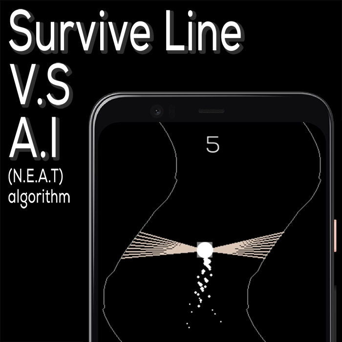

# Survive Line

<p align="center">
 
</p>

**Survive Line** is a game powered by Pygame and Artificial Intelligence, designed as my BSc thesis project. In this game, a ball navigates between two waves where they have random amplitude and the speed between them decreases over time, powered by the latest in AI technology using the N.E.A.T algorithm.

## Features

- **Dynamic Waves:** Experience the changing waves as you play more.
- **AI-Driven:** The ball is controlled by an AI trained using the N.E.A.T algorithm. It managed to play continuously for 30 min
- **High Performance:** The game runs at a 120fps providing smooth gameplay.

## AI Features

The game features an AI that can autonomously navigate through the waves without any manual intervention. Below is a video showcasing the AI in action

https://github.com/Ahelsamahy/Survive-Line/assets/10195309/7f49307b-deb6-4765-94cc-6789664209fc


## Game Footage

Here's a sneak peek of **Survive Line** in action:

https://github.com/Ahelsamahy/Survive-Line/assets/10195309/41cc46dd-8de3-48ee-bc9d-451bf78ec930


### Controls

- Use right and left arrows controls to navigate away from the waves.
- `v` Key to show vision lines for the NN
- `b` key to show the ballRect (bonding box for the ball)
- `p` key to show the particles

## Installation

1. Clone this repository:

```bash
git clone https://github.com/yourusername/Survive-Line.git
```

2. Navigate to the project directory:

````
cd Survive-Line
````

3. Install dependencies

```bash
pip install -r requirements.txt
```

4. Run the game

```bash
python main.py
```

## Contribute

Contributions to the project are welcome! Please fork the repository and submit pull requests with your proposed changes.

## Thesis Document

For those interested in the detailed technical and scientific documentation, the thesis is available in [LaTeX format](https://ahmedmahfouz.me/thesis#gameDownload).
