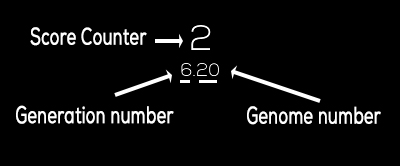

# Related work

The project itself was purely an idea I got as application for AI. There would be a need still for sources to help me get the idea into a real thing that is applicable. The problem I had mostly with the implementation was getting the documentation of PyGame and know what is the best implementation for each function I want to implement. While making an a game for PC, you have to think wisely about the sources and how to use them in your favour.

## Running library (PyGame)

The base for the game is made on [PyGame](https://www.pygame.org/wiki/about) library. It is "a set of [Python](http://www.python.org/) modules designed for writing video games. PyGame allows you to create fully featured games and multimedia programs in the python language". You can also control anything in the game itself, as you would have a main loop that you can think about as the frames per second of the game. Getting to know the library was easy, because of my old experience in python, and the documentation was easy. The library have been around for some time now, which made it easy to get a 101 guide on how to get the basics.

There was one main part while making the game, developing the GUI. Making the interface for the game was a little hard as it would take much time to know the draw function, such as writing a text on the screen. During the AI training, there are info that show on the screen to make reading the log is easy, like the **score** and **generation number** along side with **genome ID**. Writing the info isn't a easy drag and drop like most of gaming engines, but everything have to coded on the screen with x and y coordinates.

What is good about PyGame library is that it allowed me to make the game dimensions to be dynamic. The screen resolution for the game while developing it was 400*800, but as most of the components on the scree are made in relation to the screen resolution the user define from the code, then you wouldn't have to change every component location form the code, the game will do it already by itself. 

