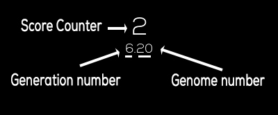

# Technologies

The project itself was purely an idea I got as application for AI. There would be a need still for sources to help me get the idea into a real thing that is applicable. The problem I had mostly with the implementation was getting the documentation of PyGame and know what is the best implementation for each function I want to implement. While making an a game for PC, you have to think wisely about the sources and how to use them in your favour.

## Running library (PyGame)

The base for the game is made on [PyGame](https://www.pygame.org/wiki/about) library. It is "a set of [Python](http://www.python.org/) modules designed for writing video games. PyGame allows you to create fully featured games and multimedia programs in the python language". You can also control anything in the game itself, as you would have a main loop that you can think about as the frames per second of the game. Getting to know the library was easy, because of my old experience in python, and the documentation was easy. The library have been around for some time now, which made it easy to get a 101 guide on how to get the basics.

There was one main part while making the game, developing the GUI. Making the interface for the game was a little hard as it would take much time to know the draw function, such as writing a text on the screen. During the AI training, there are info that show on the screen to make reading the log is easy, like the **score** and **generation number** along side with **genome ID**. Writing the info isn't a easy drag and drop like most of gaming engines, but everything have to coded on the screen with x and y coordinates.

What is good about PyGame library is that it allowed me to make the game dimensions to be dynamic. The screen resolution for the game while developing it was 400*800, but as most of the components on the scree are made in relation to the screen resolution the user define from the code, then you wouldn't have to change every component location form the code, the game will do it already by itself. 

## AI library (N.E.A.T Algorithm)

"**N**euro **E**volution of **A**ugmented **T**opologies. And this is what's known as a genetic algorithm"[Python Pong AI Tutorial - Using NEAT - YouTube](https://www.youtube.com/watch?v=2f6TmKm7yx0). Think of it as the way that is used in humans to learn (going back to the example of kid and ball) also the natural selection of the ones that perform good as humans and smarter, they managed to reproduce until today. Unlike the others who were not fortune enough to have what it takes to survive in different scenarios.

In other words to explain it "There is a larger category called TWEANNS stands for topology and weight evolving artificial neural networks" [A.I. Learns to Play Sonic the Hedgehog - NEAT Explained! - YouTube](https://www.youtube.com/watch?v=5RR1T_-zVws&) "these are algorithms that not only evolve the strength of the connection weight for a fixed network topology, but actually evolves both the topology of the network and its weights" the scientists behind the neat algorithm identified three major challenges for tweanns:

1. Meaningful crossover: by tracking genes through historical markings.
   This stops the algorithm from blindly crossing over the genomes of two neural networks and creating unnormal mutated neural networks. There are two way to progresses through a user-specified number of generations, "with each generation being produced by reproduction (either sexual or asexual) and mutation of the most fit individuals of the previous generation" [NEAT Overview](https://neat-python.readthedocs.io/en/latest/neat_overview.html).
   - Sexual: means that the new generation will be made out of the best performed genomes **from the previous generation**.
   - Asexual: algorithm will **generate a random genome** to reproduce with the highest fitness score genomes to make the new generation.
2. Speciation: protecting structural innervation through speciation.
   That protects new structures as they are typically low on hidden networks numbers, allowing them to optimize with each other on their own. You can say category before we eliminate them. This is done by splitting up the population into several species based on the similarity of topology, connections between neurons and their weights and biases. They only compete within their species because some of them who aren't performing well at present, can perform well in the future after the right mutatuon with each other without the need to eliminate them now.
3. Structure complexity: incrementally growing from minimal structure.
   It holds the algorithm from creating complex networks at the beginning of the new generation that may have to later, reduce the number of nodes and connections. They did this by starting all networks with no hidden layers between input and output layer. NN only has a series of connection genes between them and if it is found to be useful and necessary to tweak the output a little, then it can involve in complexity.

They designed N.E.A.T to specifically address each one of the above characteristics. Point (2) and (3) will be explained more in details at the explain the log**** part from timeline chapter.

