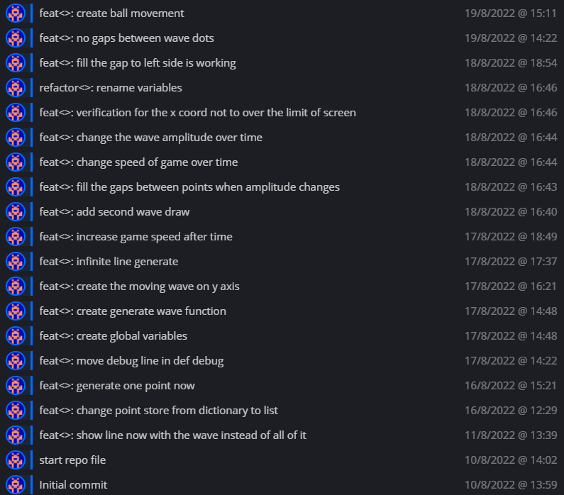
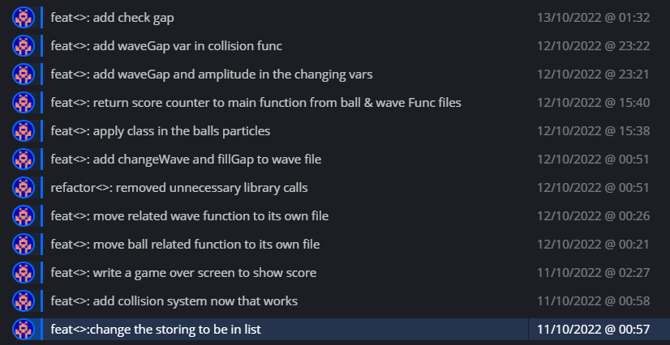

# Summary

Here, I will review the findings from the previous sections. I will consider the implications of AI in this paper regarding its performance compared to human playing a game. I Will  also include a discussion of any lessons learned from the project and any future work that can be done.

## The game development

The progress of the game took most of the time due to the lack of sources in the PyGame library with the right functions that I was looking for then. Generating the function was the part that took most of the time. I remember that I spent more than a month trying to figure out a way to make the wave have a random amplitude so the player wouldn't cheat in the game. The problem was finding a way to make the wave one sequence after generating with the new amplitude, as it would shift the new sequence by a specific amount of pixels on the x-axis, either positively or negatively, in relation to the last point in the old sequence.

Dealing with the other parts, such as, making the game follow the principle of encapsulation, took more than 3 days of continues work. Something I had before, is the problem of one file that does the functionality for all components of the game. For instance, the reset function that existed in `ball func`, it is responsible for resetting the whole game including wave related variables. It is better to have a class for the wave, then in it have function to reset the related variables for it. You can call the wave functions whenever you want.

As for my opinion, this is better because I would get confusing with what variables to call and to get a better file management to each part of game components. 

  

## The AI tweaking

Won't name it development as I'm not the person who made the algorithm, nor the one who made it as a python library.

This part didn't require much tweaking, as it was just to leave the laptop to do the training sessions for the night and check the log in the morning. To compare between each generation, I had to add extra `print()` sentences in the log to keep track of it. It was also important to record the sessions with OBS, as I could navigate easily from the output code to the part in the video and then tweak it as much as I could for the next generation.