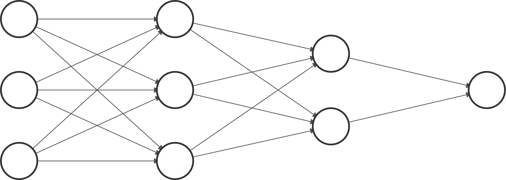

# Timeline

The first step of developing the game was choosing a programming language that would be helpful in both showing graphics on screen and implement an AI algorithm, the only option that was convenient enough was python as:

- The most famous programming language with AI libraries that have a good documentation.
- It is OOP, which means i can have a class for each component of the game easily to make an instance for the AI to train from.
- A library to draw graphic on screen while it won't need heavy CPU usage that won't throttle the process of AI learning 

Going for a library for the game was the first step as it would define the characteristics, i went for **PyGame** because it was nearly the only one that is good enough with documentation to start with, and quit enough, the main focus isn't about making a game that will have that much of physics in it and 3d animation, for now, the imagined picture of the game is a rectangle as a screen that will have two main component of the game, a wave that is on one side of the screen vertically and one on the other side with the only difference is 350px (the starting amplitude is 50px and the screen width is 400px) and a ball that the **only purpose for it is to survive the as much as it can, without hitting any of the sides of the wave**.

I'm minimalist when it comes to developing things, like there wouldn't be splash screen all over, and hard controls, not even hard rules, and it will be the approach I'm following with the game, to break it into steps

1. The accent colour of the game will be black as a background
2. White will be used to show elements 
3. Score counter on top
   1. AI mode: show generation and genome number
   2. AI mode: show total runtime
   3. AI mode: show the vision of the ball

During the writing here, i will raise some questions that might come to your mind while working on some parts (as they might have came to me too) and will try to answer them at the end of every section in the chapter

## Develop the game

 The files layout of the game will be an `AI.py` file in the root folder, then subfolder named `SurviveLine` with 3 files in it `ballFunc.py`, `waveFunc.py` and `game.py`, and to make it easy to make instance of the game, will create a file named `__init__.py` that will only have one line it it `from .game import Game` that means we will have a `Class Game():` in the `game.py` and it is used to call the `game` function as a library in the `AI.py` file (as it is in another folder) and make instance from it. Every major component will have its own class in file to refer later. 

### Wave functionality

To get the base function of wave there would be a lot of functions to cover like:

```python
def draw(self, Display):
    #increase the FPS of game
def changeSpeed(self):
    #change the wave aplitude and increase the wave gap
def changeWave(self):
    #generate a new point on Y axis
def generateWave(self):
    #add point to the list of points
def addPoint(self, index, point):
    #check if there is a gap 
def checkGap(self):
    #function to fill it
def fillGap(self, gap, gapDirection):
    #reset all the self. variable that are made in __init__ class 
def reset(self):
```

most of them are self explanatory, but the ones that need more dive into details are the `generateWave`, `checkGap`and `fillGap`

#### Generate Wave

The starting point of the game, in the `waveFunc.py` to make a main class `Class Wave():` with  an equation that can generate a wave and at the same time I can change in the variables of the wave to make it harder for the player, these variable are 
wave amplitude\footnote{is the maximum or lowest height the wave can go in one point to up or down} or 
wave frequency \footnote{the number of waves that can go through a fixed distance in amount of time} with all of this in calculation, it means that I can make the game harder by making the behaviour unexpected for the next move, also to go extra step, there will be a decrease in the gap between the two waves to limit the player's movement.

```python
pointsList_XCord = int((self.HDisplay/2) + self.WaveAmplitude* math.sin(self.waveFreq * ((float(0)/-self.WDisplay)*(2*math.pi) + (time.time()))))
```

%add caption here

as you can see, there are some variables that have the `self.` before, that are defined as:

```python
def __init__(self, wDisplay, hDisplay):
        self.WDisplay = wDisplay
        self.HDisplay = hDisplay
        self.ScoreCount = 0  # will come back later for it, in the loop IMPORTANT
        self.waveFreq = 1  # will change later in difficulty part
        self.WaveGap = 0
        self.GameSpeed = 2  # to increment the difference in time to speed the FPS
        self.FPS = 60
        self.WaveAmplitude = 50
        self.PointsI = 0  # index to loop inside the points list
        self.PointsList = [0]*800
```

These are the variables that are only (and not specifically ) linked to the wave functions, and this is where an important functionality of OOP comes in ,that is encapsulation, to get all the related data to a class (which is wave class at this point), in it only and not others, if it is needed in other classes, then an instance of class wave can be made then the variable can be used from it.

The equation in figure #### is going to store the X axis coordinates in a list called `PointsList` for the sake of adding points to it once they are generated and show them on screen one by one as if it is loading, because if there isn't list, then the wave would be a steady visual sine wave (without changing amplitude or frequency yet), this part of code is placed in `def generateWave(self)` function.

There have to be more condition to make the points be generated without disorder, like one point won't be in the other half of screen, which means that when the 350px is added to it, it will be out of the borders of the display.

#### Check gap

After generating a point, with the change in amplitude, the next point that is added to list of points, doesn't have a difference of only 1px with the one before it, so that means that there will be a different line segments in the list and a gap between the old point and the new one, to overcome this, after a point is generated, there is a `for loop` that checks is there is only one pixel gap between it and the point before it, either it is minus or negative as the gap can be to left side or right side


#### Fill Gap

if there is one part which took the most in the developing, I would say it is this part, because there were different approaches to solve the problem, first one is either to move the point on y-axis by the gap then make a straight line from the old line segment to it, and the second one was to get the point just to be minus on the x axis then be linked to it. the first option was better for the sake of visibility and not effecting the next point respectively. There were lots of ways (or you can say conditions) that needs to be covered in the point list, for example what if the gap is at the end of list?  will throw "out of index error" when trying to shift the new point by the amount of gap, one way to cover this is by removing amount of points from the start of the list, then add the same amount at the end where you need it,

Say that the gap is over the limit of list (800Px), dealing with it before was just to make the gap limited to the end of list, so if the point is at index 797 and the gap is 10 (that means there will be an out of index at extra index 6) so it was just to make it limited to  `gap = DISPLAY_H - POINTS_I - 1` but the problem is that it wouldn't work on high scale when the amplitude gets higher.
To deal with it is to remove the over-points in gap from the beginning of the list and add empty points of the same amount at the end then make the index go back to the new index, (back to the same example), It will remove 6 points from the beginning of list then add empty 6 points to the end, and shift the index to 6 points in the back so it stays with the new point.

```python
if self.PointsI + (gap) >= self.HDisplay-1:
	untilEnd = self.HDisplay-self.PointsI
	toAddFromStart = abs(gap-untilEnd)
	del self.PointsList[:toAddFromStart]
	toAdd = [0]*toAddFromStart
	self.PointsList.extend(toAdd)
	self.PointsI -= toAddFromStart
	gap -= 1
```

with every line here looking like a weird by itself, you would need some explanation:

- Line 2: calculate the difference between the ending point of list and the starting point of gap
- Line 3: get the difference in gap and the point
- Line 4: delete the amount of point from the beginning of list
- Line 5: create empty list with the amount of delete points from beginning of list

Now with the condition being fulfilled, it comes to fill the gap itself, there would be a two options (or ways you can say) if the gap is negative or positive, but I will discuss one  the negative gap and the other one have the same implementation with difference being the sign

```python
if (gapDirection):
	# to move the point according to gap
	self.PointsList[self.PointsI + gap] = self.PointsList[self.PointsI]
	self.PointsList[self.PointsI] = 0
    #the step is different for gap direction, as it would be -1 or +1
	for x in range(self.PointsList[self.PointsI-1], self.PointsList[self.PointsI+gap]-1, (gap//gap)):
		self.PointsList[insideY] = x+1
		if insideY < 799:
			insideY += 1
```

first it moves the first point in the new line segment by the amount of gap, then resets the old value of it to zero (as it will be part in the straight line), secondly is a for loop to fill the points incrementally starting from the last point in the old line segment to the new point.

#### Second way to fill the gap

Fill the gap was basically working on the base of shifting the point on Y-axis, but there might be another approach to tackle this( the second way I talked about in fixing the problem of gap).

Thinking that it will take more effort to move the point in new line segment in the position that corresponds to the gap, then make a line between the old line segment and the new one, that is a lot to think about, there can be a different way, what if we change the point on x-axis? just to make it close to the old one, I know it is a bit of cheating, but as long as it works, then it is good.

The idea is that if I can calculate the gap (which I already know) then decrease the new point by the amount of gap + 1 (if it is a positive gap) and will be -1 if it is a negative gap , you may ask, "why didn't you use absolute value for amount of gap as left is the same as right?" because then this would mean that the wave would increment in one way which depends if it is +1 or -1.

The newly implemented function is called `def shiftOnXAxis(self, newPoint)` in `waveFunc.py`

### Ball functionality

The main focus when working on the ball was to make it as simple as it can be so a new instance can be done from it without the need to store a self-genome variable, so every genome would have its own variables that can be changed with a new instance made.

#### Draw ball

As the game is based on a **ball** that survives a line, then I need to display a ball and not a circle(google the difference), there isn't a function to draw a filled ball in one line, so I have to draw an empty circle then fill it, the function `pygame.gfxdraw.aacircle` will draw an anti-aliased circle and `pygame.gfxdraw.filled_circle` draw a filled circle inside of it, then draw a fake rectangle around them with `pygame.Rect` that will deal with the collision (will discuss it in the display game section)

#### Generate particles

This part is little on logic than the other because it was made for the visuality of the game, no output coming out of it to make the game faster or improve something, but it would add a little bit of a characteristic to the game and the vision I have for it.

The particles are made to be in the position of the ball and generate as a way to look like a combustion engine steam coming out ot it, so there are three things to notice here

- Location: where the particles will start and their ending point

- Velocity: the amount of particles that will be generated in a second

- Time: how long they will last on the screen


With this in consideration, we can start writing a function for it 

```python
def generateParticles(self):
        Loc =[self.ballCordX, self.ballCordY] 
        Vel = [random.randint(0, 20) / 10 - 1, -3]
        Timer = random.randint(4, 6)
        self.Particles.append([Loc, Vel, Timer])
        for particle in self.Particles:
            particle[0][0] -= particle[1][0]
            particle[0][1] -= particle[1][1]
            particle[2] -= 0.1

            pygame.draw.circle(self.GameDisplay, (255, 255, 255), [int(
                particle[0][0]), int(particle[0][1])], int(particle[2]))
            if particle[2] <= 0:
                self.Particles.remove(particle)
```

In the `Vel `variable deceleration part, it makes sure that the value we would get, would be a random number between {-1, 1} and the `Timer ` to give chaos to the particles so not all of them are released at the same time.

The code would add to list of particles a new one with these random starting values, then the for loop process each value on its own.

- Line 7: it process the position on X-axis to the velocity also on the X-axis, same would happen to the Y-coordinates
- `particles[2]` is to reduce the particle radius by 0.1 in every frame (which is every loop then) 
- If condition at the end to remove the particle from the list so it wouldn't take much of space

This function is posible thanks to 

[^https://www.youtube.com/watch?v=F69-t33e8tk]: Particles - Pygame Tutorial by  DaFluffyPotato


########second section of header########

## Display the game

Getting all of the parts coming together is based on logic, as there are lots of changing in it with variables in each game component `waveFunc` and `ballFunc` but the basics are made in the game and now about displaying them from the `game.py` file that will deal as an instance of all game component, like the string that will keep all of them tide up.

### Draw

There are basic things in the game that a user would need to always see them during the runtime of it, like the wave so they won't hit it, the ball to know the position of it, maybe the particles to add some visuality to the game and the score on the top. Most of these functions are already made in the components class but needs to be called here, in the `game.py` file.

#### Update label

In order to type anything on the screen in PyGame, you need to

1. Instantiate first the font you will use, how big it will be
2. Decide what to write then make a position for it on the screen
3. Blit (show on screen) 

It can be thought of as a harder way just to write a simple text, but it gives more freedom to customize the text before writing it and also a CPU consuming wise when comes to graphics options that you might not need like anti aliasing.

#### Display score

There is a need for a counter in the game, to be incremented each time the main `While` loop in the game makes a new round, so it would work as a way  to measure the score of the game (also fitness for AI), this `ScoreCount` will be the way to measure it, but as every loop, that is +60 (FPS of game) points in every second and I think it might be a little bit over, so I will divide it by 200 and place it on the middle top part of the screen, now first part of the game requirement is over, with displaying score 

#### Display AI number

As a way to keep record of the training sessions of AI is to find the generation number and genome number (if you don't understand these expressions, it is ok, I don't also, but I will read about them once I reach the AI part and tell you more there) because during the learning period, I won't be staring in my screen the whole time, so there have to be something I can know which genome did better and the time for it, and the log will be in CMD after every genome and will use OBS to record the game window only, so I return to the video at anytime 

### Collision

Basics of collision is when there is an object that overlaps another object and they shouldn't, to implement this on the game. A collision would be triggered if the ball overlaps any point of the wave points that corresponds to the same x axis points with it.

In the Ball component class there is a `ballRect` functions, that returns an invisible rectangle that surrounds the ball with lots of important functionality in it, basically I can access all the coordinates of every edge in this rectangle that would help in the collision, and this will be the way to detect for the ball.
As for the collision function working mechanism, it loops through every point in the wave with the range of the ball, in this case it is  calculated by the full height of screen (800 px) minus the bottom of the ball (238 x-cord) $800-562 = 238$, this is the starting range, ending range will be the the top of ball $800-538 = 262$, for the right side of ball, if the x value for it is over or equal the x-axis of the point in list with the same axis -50 - the wave gap then it will be collision, also on left side, if the x-axis of left side of ball is less or equal the x-axis of the point in list with the same axis - 350 - the wave gap then it will be collision.

```python
#                                      238          ,             262
        for YCord in range(self.HDisplay-ball.bottom, self.HDisplay-ball.top):
            if (Wave.PointsList[YCord] != 0) and (ball.right >= Wave.PointsList[YCord]-50-Wave.WaveGap):
                return runLoop == False

            if (Wave.PointsList[YCord] != 0) and (ball.left <= Wave.PointsList[YCord]-350+Wave.WaveGap):
                return runLoop == False
```

You might ask, why make a rectangle be responsible for the detection of a ball object, the problem is limitation in the library itself to choose object that you want to have detection with, even pixel wise, it is 5 pixel on the top for each side the decreases way down until the middle of ball, so it isn't that much to think about 

### Move ball

Remember what I said about OOP and every class should make what is limited to? that is the when it comes in handy as here i can the limitation I want for the ball movement, and not in the ball class.

there will be buttons assigned to each movement in the class to get the ball around the x-axis only, so the function gets "right" then it call the move ball function in `ballFunc.py` file to add to the x-axis of the ball the amount of steps that is 5px also the same with left side, limitation is not to get the ball out side the borders of screen and an extra half of the radius of ball because it wasn't looking good having the whole ball stuck to the screen side as a limit.

You might ask me, "why make the parameter for function a string and not a Boolean variable as there are two types of movement only?", I'm not going to lie, I had it during the whole game to be as a Boolean variable, until the implementation of AI, then I changed it to string, why? because in first place i thought the Neural network would have 2 output (left and right movement) but there would be a third one as not moving, or centre, to make the ball steady during the training and not wiggling around.

### Count distance

As of the early implementation of the AI, the input was (from left to right) the:

- distance between the centre of ball to the point in wave with the same x cord both left and right
- ball x cord

But the problem is the collison covers the whole ballRect (that is 24 pixel) and the NN can only have input of the centre, to solve it you would need to pass a list of the distance between the points on ballRect and the wave on the side, here is a big dive into it.

To work on the right distance, there is ballRect that covers the whole ball and responsible for the collision detection, and there are points with the corresponding x axis on the wave that if any point on the ballRect overlap one of the points (with same x axis) on the wave, the collison will be triggered and this genome will be over, to think more into details, I need to check first with the point on the bottom right side of the ballRect with the one same as x axis on the wave, then move one point up one wave and calculate it (using Pythagoras) when the points on list are over, then move one pixel up the ballRect and repeat the same on the wave.


<p style="text-align:center;font-size:13px">keep in mind that the starting point is in the middle of the ball in the image, but it is just a simple way to say that there is a vision</p>

```python
def countDistance(self):
        """
        make a list for distance between the bottom edge of ballRect to the corresponding point on the wave 
        with the same x-axis, then one step up on wave and repeat, and make another loop to do the same with the ballRect
        """
        ball = self.Ball.ballRect()
        Wave = self.Wave
        rightList = []
        leftList = []
        self.showedLines.clear()
        # the starting point here is the bottom of ball and the end is the top + 20 px for prediction
        # increased the step size because there was lag for the whole process to be handled
        for YCord in range(self.HDisplay-ball.bottom, self.HDisplay-ball.top+20, 5):
            for YBall in range(0, ball.width, 5):
                dxR = pow(Wave.PointsList[YCord] - 50 - Wave.WaveGap - ball.bottomright[0] + YBall, 2)
                dxL = pow(Wave.PointsList[YCord] - 350 + Wave.WaveGap - ball.bottomleft[0] + YBall, 2)
                dy = pow(abs((800-YCord) - ball.bottomright[1]+YBall), 2)

                rightList.append(int(math.sqrt(dxR+dy)))
                leftList.append(int(math.sqrt(dxL+dy)))
                self.showedLines.append(YCord)
        return rightList, leftList
```


Sounds good, but the problem is that the for loop was CPU consuming, imagine there are 24 pixel then repeat it again for the wave ones (a two inner for loops) $24^2 = 576$ and another one for the left side $576*2 = 1152$,  and to process them again on the AI input , that is $1152*2 = 2304$ times, all is made in one second, not to add the particles that are being made behind the ball, all of this was a lot. To make a little better, I reduced the step size to be 5 for each loop, made it to 45 in each list and got the inserted value to be as integer.

|                    576 lines on each side                    |                       45 on each side                        |
| :----------------------------------------------------------: | :----------------------------------------------------------: |
|  |  |

<p style="text-align:center;font-size:13px">the amount of new lines isn't fixed and will be changed later</p>

you might ask "will this reduce the vision of the AI ?", quite frankly, I think if it could handle itself with only one point in the past, then, it can do better with 45 line on each side, it even gave more space to add extra point, so it can see the future now (an extra 20 points on wave)

### Show Vision

The speed of learning during the AI would be faster than a human can play a game, and due to the amount of loops that are made every time in the main loop `while`, the calculation time is a lot to take, so to make the things smoother, there are vision lines of the ball that would help in viewing what the ball is actually seeing (or detecting) on the wave, but there would be a control for it in the `draw()` method so it doesn't slow the process of game by pressing the `v key` it would switch it on or off. 

### Loop

There are some functions that need to be always working during the game, like changing the wave amplitude,increase the `ScoreCount` by one and change the game speed as in FPS, this is just a holder for them so it doesn't get missy in the AI part  

### Reset

calls the reset function in components class in the `Wave` and `Ball` and is triggered once the collision happens

## Create AI

As the progress of the thesis can be separated into two parts, I can say now that the first part is over with making a fully functional game that satisfies the requirements, now the second part is making AI that can reach a high score in it despite the difficulties that are made with the ball surviving through the game more, such as, changing the amplitude and the increased speed.

There are a lots of algorithms that can be used to develop such a neural network that is capable of this task with changing the weights and biases without me interfering in it, but first, I feel like I'm going over lots of expressions here that needs to be clarified first.

### 101 AI

The way for AI to work is try to make mimic the way of human brain to work, but this means that the human brain itself is going to develop such an intelligence that is overcoming it ?!?!, it raises some red flags here, but the closest it can get to (at least on my humble machine) is make a neural network capable of solving only one task, that is totally different from the human brain being capable of doing multiple tasks in short period of time, like taking input from senses and giving the output in action without mentioning controlling your breathing and heart beat without you thinking (now you are thinking about them?).

To simplify the process of a human brain, since a young age when you were a child, you got to learn that something is dangerous or safe, right or wrong, by trying and then learning from your own mistakes that is called **Reinforcement learning**  <a href="[Supervised vs Unsupervised vs Reinforcement Learning | Intellipaat](https://intellipaat.com/blog/supervised-learning-vs-unsupervised-learning-vs-reinforcement-learning/)" target="__blank">types of AI</a>, and this type is the main point in making the AI.

#### Life example

Given example of a child trying to kick the ball, this is the first time a child sees a ball, and doesn't know **yet** what to do with it, so the child here is called an agent, and the football is the environment that is trying to solve or in this case, kick it as far as it can be (which they don't know yet) the agent try to touch the ball but it isn't the goal they are seeking to reach (trying over time), after some time of hitting it harder, they realise it won't hurt them (as a punishment) and if they score goal it is good (as a reward). 

That is the same way AI is learning in this game, the ball (which is agent) is trying to survive as much as it can between the two waves (environment) but it doesn't know if touching any of waves will end it or not, so the ball try to use one of the three controls it have (left, centre, right) and if it goes totally left, it dies, same as right, but if it stays in the middle, it will survive the most, at least for now.


<p style="text-align:center;font-size:13px;font-style: italic;">Deep Learning vs. Machine Learning – What’s The Difference? via. levity.ai</p>

As mentioned in [counter part](#display-score) there is a counter in the game, it will be used as what is called "fitness function" that measures how good is our genome doing, and an input for the ball in order to give a proper output of movement to survive as far as it can, here is another unknown expression.

#### Fitness function

There must be a way to reward or punish the AI according to its behave during the game, the more the ball survive the wave, the higher the fitness score for it will get(better quality it is), meanwhile if it dies on early stages, the fitness score for it will be reduced drastically as a punishment and also be lower in the hierarchy of genomes in the generation, so the possibility for it to be mutated into future generation will be lowered.

Applying this method in the game here, there is a way of reward, if the ball stays in the middle between the two waves, that is for the sake if there is an immediate change in the wave curve, the ball is less venerable to hit into it.

```python
leftDis = int (output[0])
rightDis = int (output[2])
if(len(str(leftDis)) and len(str(rightDis)) > 2 ):
    if round(leftDis, -1) == round(rightDis, -1):
        fitness += 2
```

Explained from inside out, the fitness is increased by 2, if the rounded output for left order == rounded output to right order, but first it checks if both of them are more than 2 two digits so it can round if the numbers are hundreds only.

As for the punishment, if the genome dies at the beginning of where it was, and without any movement from it to survive, the fitness score will be reduced, the point here is try to find the good punishment for it and not over do it, so it can be balanced.

```python
if(fitness < 300):
	fitness -= 20
```

There was an early implementation to add reward in case the ball takes the output of staying in the middle and not wiggle around with right and left only, but the ball managed to overcome it and also waggle(as it sought a change in the input more than the reward it would get), so the other way, was to make the distance equal on both left and right sides is the reward.

#### Neural network

In order to take a decision, there is an input, then an amount of process are made in between to have an output, this is what is called neural network, it consists of layers that modify the input along the way to decide what it will be at the end of it, as an output, the small fundamental creating piece for NN is called a **neurons** , same as in human brain (but not the same amount!) and there are input neurons that are found in the first layer, then processed to the second layer and modified to the third one, with the summation being in the output layer.



#### Weight and biases

In the early stages of the ball when it is learning how to control its movement, the first steps are either going totally to left or right, which isn't really paying off to make it go far, so each neuron have to tweak the parameters it gets from the one before it, the weights and biases are the one responsible for this, going back to the child example, the brain consists of little neurons that are responsible of making every decision the child take, and it changes over time, and it is the case here, the brain changes a little bit on the decision and try different approach too the problem, one time hit the ball hard to left side, one time with little power to right side "**Weights** control the signal (or the strength of the connection) between two neurons. In other words, a weight decides how much influence the input will have on the output." [ref](https://machine-learning.paperspace.com/wiki/weights-and-biases)

#### Activation function

The connection between neurons and each others, have weights and biases to alter in them, but let's say that there is one neurons that the value from it isn't important and can be used when the input is different, even to say that it doesn't exist at all, but only to one specific neuron in the layer after it, if it was to be removed, it would change the value to all the neurons after it.

That is what activation function is for, alter the value for one specific neuron and decide if it will have more (or less) impact on the neuron that is after it with the connection in between, as the name state "Activation" the value for it is between 0 and 1 for each neuron.

You might ask "why use an Activation function, isn't it changing in the numbers as the same way the weights and biases are doing ?" yes and no, so the weights and biases alter the number **that is going from one neuron** to another, but activation function **change the effect** of the neuron to the one after it.


<p style="text-align:center;font-size:13px;font-style: italic;">Deep Learning vs. Machine Learning – What’s The Difference? via. levity.ai</p>

#### Genome

All the info about the previous parts above can be collected into one thing here, the genome is the collected part for all of this, it works on neural network that relies on  weight and biases to change the input until output and uses a fitness function, one population exists of a pre-defined number of genome inside of it, it can be called also children of the generation.

### What is N.E.A.T ?

### Tweak AI

The algorithm uses the way of punishemnet and reward to make it learn, there 

```

the goal in this phase is to make an optimised settings for the NN to reach the maximum score it can get to, and tweak the numbers in favour of faster learning and higher fitness score.

### Observation

As first time running the algorithm, the input vision for the ball to the wave, was from the centre of ball to both sides of the wave as a one point, that made it hard for the ball to find its way or have a futuristic vision you can say as there would be a change in the wave curve and the ball can't detect it, so an idea came of having more range for the ball to see, as it would calculate the distance between the ball recatangle to the left or right side of wave in more than one point.

To get more into it with numbers, there would be a notice of having the ball a weird sense of getting to know its "new" sense of wider vision diameter, it would take about 20 generation just to start moving in more random left and right and this is made when the ball had only the vison of its radius as a 24 pixel (12px as radius) then extra step of plus 50 pixel, getting this info in nutshell

- One point vision: good as start and better CPU wise
- Diameter vision + 20: best one in score yet (117 points in generation 89)
- Diameter +50 points: No learning even after nearly 300 generation

The reason to increase the vision for the ball (even though it was working fine) is i wanted to test how long would it take from the ball to get used to the new (increased) amount of lines, and I can tell you it took long long enough.

At this point of the game, I implemented the increased speed of wave *4 , that is 4 times the normal running time of normal pace of game, and the generation threshold to be 300 generation instead of 100, let the laptop run as much as it needs, it took more than 15 hours to finish 294 generation and 11 genome, when went back to check the log, none of them managed to pass 3000 fitness score, that means that none of them had a good intuition of the lines to move left or right and at least overcome one curve in the wave. From this, the amount of numbers increased = more time in training.


### explain the log

